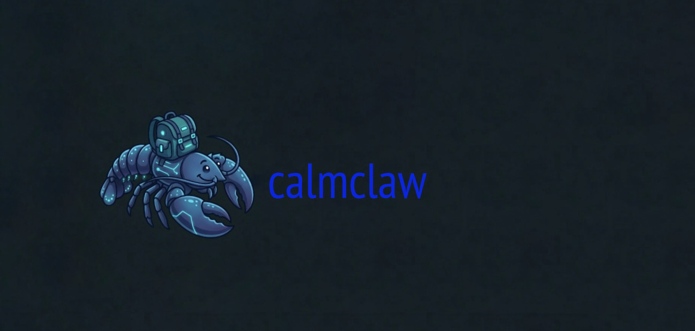

# CalmClaw

<p align="center">
    
    <br>
    
    
    
    
</p>

CalmClaw is a local-first AI agent built specifically to work with LLMs on consumer hardware. By removing cloud dependencies and subscriptions, it reduces long-term costs and ensures your data never leaves your device. This project is a hands-on way to develop local agentic workflows while managing the specific limits of memory, context windows, and the slower speeds of on-device processing.

Local models aren't as fast or capable as cloud-based models yet, so CalmClaw is really just a starting point for what's possible right now. Even if the gap with cloud models stays huge, it will be interesting to see when the performance actually becomes good enough for daily use.

---

## What it does

- **Chat**: Talks to you via Telegram
- **Web browsing**: Browses the web using your local Chrome via CDP
- **Terminal commands**: Runs shell commands on your Mac
- **Scheduled tasks**: Runs autonomous LLM tasks on a schedule (e.g., daily news briefing, executing external scripts)
- **Reminders**: Sends you one-time or recurring reminders
- **Persistent memory**: Remembers context and honors your personal preferences

---

## Working within local constraints

Local models have small context windows and slow inference; CalmClaw addresses these limitations:

- **Context compression**: When the agent exceeds the token limit, it automatically trims its own history before continuing. The compression planner is pluggable. The current implementation uses a Genetic Algorithm that decides whether to **Keep**, **Compress** (summarize), or **Throw** earlier messages while keeping recent activity and important tool results intact.
- **Temporal awareness**: The agent is injected with the current date and time on every request to avoid unnecessary tool calls.

---

## Tested hardware and model

CalmClaw has been developed and tested on:

- **Hardware**: MacBook Pro M1 Pro, 16 GB RAM, running macOS Tahoe
- **Model**: OpenAI [gpt-oss-safeguard-20b-MLX-MXFP4](https://huggingface.co/lmstudio-community/gpt-oss-safeguard-20b-MLX-MXFP4) (4-bit quantized, ~10 GB)

The current model uses OpenAI's **Harmony response format**, a native multi-channel tool-call protocol with special tokens (`<|channel|>`, `<|message|>`, `to=functions.*`). The parser in `main.py` is built specifically around this format. Other MLX-compatible models may work with adjustments to `ENDPOINT_SUFFIX` and `MLX_SERVER_MODULE` in your `.env`, but will require parser changes for their tool-call format.

---

## Requirements

- macOS Tahoe with Apple Silicon and at least 16 GB RAM
- Python 3.14+
- A Telegram bot token ([create one via @BotFather](https://t.me/BotFather))
- Your Telegram user ID ([get it via @userinfobot](https://t.me/userinfobot))
- An OpenAI GPT OSS model (or another MLX-compatible model using OpenAI's **Harmony response format**)
- Google Chrome (for web browsing via CDP)

---

## Safety

> [!WARNING]
> - Early-stage project. The agent has full terminal access, LLM outputs can be unpredictable. Review commands carefully. There are no safeguards in place. If you want real isolation, run this in a Docker container or VM.
> - Save your files before running CalmClaw.
---

## Quick start

```bash
curl -LsSf https://raw.githubusercontent.com/caphil/calmclaw/main/install.sh | bash
```

Download and run the installer script. The script installs everything needed, runs the guided setup wizard, and starts CalmClaw.

Before running, have ready:
- A Telegram bot token — [create one via @BotFather](https://t.me/BotFather)
- Your Telegram user ID — [get it via @userinfobot](https://t.me/userinfobot)
- A downloaded OpenAI GPT OSS model

If you later need to change your Telegram credentials or the CalmClaw configuration → Open `setup.command` in `~/Applications/CalmClaw`. CalmClaw can be updated by opening `update.command` in `~/Applications/CalmClaw`.

---

## Current scope

- CalmClaw currently runs as a single agent instance.
- CalmClaw refrains from using a secondary lightweight model for compression. DeepSeek-R1-Distill-Qwen-1.5B was tested but could not produce summaries accurate enough for reliable compression; therefore, the primary model handles this task.

---

## Configuration

All personal data lives in the agent workspace (`~/.calmclaw/` by default):

| File | Purpose |
|------|---------|
| `.env` | Model paths, token limits, server settings |
| `.env.local` | Telegram credentials (keep secret) |
| `SOUL.md` | Agent personality and tone |
| `SYSTEM_RULES.md` | Bot capabilities and tool rules |
| `MEMORY.md` | Persistent memory |
| `REMINDERS.md` | Active reminders |
| `TASKS.md` | Scheduled autonomous tasks |
| `NOTES.md` | Personal notes |

---

## Reminders

Ask the agent to set reminders, or edit `~/.calmclaw/REMINDERS.md` directly:

```markdown
## reminder-daily-standup
- type: recurring
- due: 2026-01-01 09:00:00
- every: daily 09:00
- message: Time for the daily standup. Review your open tasks and priorities.

## reminder-client-follow-up
- type: once
- due: 2026-01-15 14:00:00
- message: Follow up with client on the Q1 proposal.
```

---

## Notes

Ask the agent to save or update a note, look through your notes, or see if there’s a mention of a certain topic.

```markdown
## read-book-titled-1984
- title: Read book titled 1984
- created: 2026-03-20 23:36:53
- updated: 2026-03-20 23:38:28

Read book "1984" by George Orwell
```

---

## Scheduled tasks

Tasks run autonomously: the agent browses, runs commands, prepares reports and sends the results via Telegram:

```markdown
## task-morning-briefing
- type: recurring
- due: 2026-01-01 07:30:00
- every: daily 07:30
- task: Browse for today's top business news. Summarize the 3 most relevant topics in bullet points in markdown format, save to file on desktop using format YYYY-MM-DD_news.md and then inform user.

## task-weekly-summary
- type: once
- due: 2026-01-05 17:00:00
- task: Run a summary of this week's activity: check recent bash history, open files, and provide a short executive summary.
```

---

## Telegram commands

| Command | Description |
|---------|-------------|
| `/reset` | Clear conversation history |
| `/messages` | Show message count, total chars and tokens |
| `/compress` | Manually trigger conversation compression |
| `/throw <idx> [idx ...]` | Remove messages by index (index 0 protected) |
| `/thrown <N>` | Remove the last N messages |
| `/ram` | Show current RAM usage |
| `/env` | Show current environment configuration |
| `/quit` | Shut down the agent |
| `/reminders` | List active reminders |
| `/clearreminders` | Remove all reminders |
| `/tasks` | List scheduled tasks |
| `/cleartasks` | Remove all tasks |
| `/notes` | List saved notes |
| `/clearnotes` | Remove all notes |
| `/memory` | Show persistent memory |
| `/clearmemory` | Clear persistent memory |
| `/soul` | Show agent personality |
| `/clearsoul` | Clear agent personality |

## Advanced users

`install.sh` installs `uv` if it is not already present, downloads this repository, sets up a Python environment, then runs the guided setup wizard `setup.sh` to create the agent workspace, configure CalmClaw, and set Telegram credentials.

- `CALMCLAW_DIR` sets where the agent workspace is bootstrapped based on `/templates` (create if not exists, no overwrite).
- `INSTALL_DIR` sets where the code is cloned.


**Install**
```bash
INSTALL_DIR=~/Applications/CalmClaw CALMCLAW_DIR=~/.calmclaw curl -LsSf https://raw.githubusercontent.com/caphil/calmclaw/main/install.sh | bash                # interactive
INSTALL_DIR=~/Applications/CalmClaw CALMCLAW_DIR=~/.calmclaw curl -LsSf https://raw.githubusercontent.com/caphil/calmclaw/main/install.sh | bash -s -- --silent # silent
```

- `CALMCLAW_DIR` is optional. If `CALMCLAW_DIR` is given, it is passed through to `setup.sh`.
- After a silent install, set your Telegram credentials manually in `<CALMCLAW_DIR>/.env.local` and consider updating the configuration in `<CALMCLAW_DIR>/.env`:
```
TELEGRAM_BOT_TOKEN=your-token
ALLOWED_TELEGRAM_ID=your-id
```

**Update**

CalmClaw can be updated based on this repository as follows. Calls the guided setup wizard `setup.sh` when done.

```bash
CALMCLAW_DIR=~/.calmclaw ~/Applications/CalmClaw/update.sh          # interactive
CALMCLAW_DIR=~/.calmclaw ~/Applications/CalmClaw/update.sh --silent # silent
```

- `CALMCLAW_DIR` is optional. If `CALMCLAW_DIR` is given, it is passed through to `setup.sh`.

**Setup**

`setup.sh` is the configuration wizard. It can be run directly to reconfigure at any time, and is also called by `install.sh` and `update.sh`.

```bash
CALMCLAW_DIR=~/.calmclaw ~/Applications/CalmClaw/setup.sh          # interactive
CALMCLAW_DIR=~/.calmclaw ~/Applications/CalmClaw/setup.sh --silent # silent
```

- `CALMCLAW_DIR` is optional.
- In silent mode (`--silent`), uses resolved values without prompting.
- Resolves `CALMCLAW_DIR` in order: inline env → `~/.zshrc` → default (`~/.calmclaw`).
- Bootstraps the agent workspace from `/templates` (create if not exists, no overwrite).
- Writes `CALMCLAW_DIR` to `~/.zshrc` for persistence across terminals (created if missing).
- In interactive mode, walks through agent workspace, token limit, and Telegram credentials.
